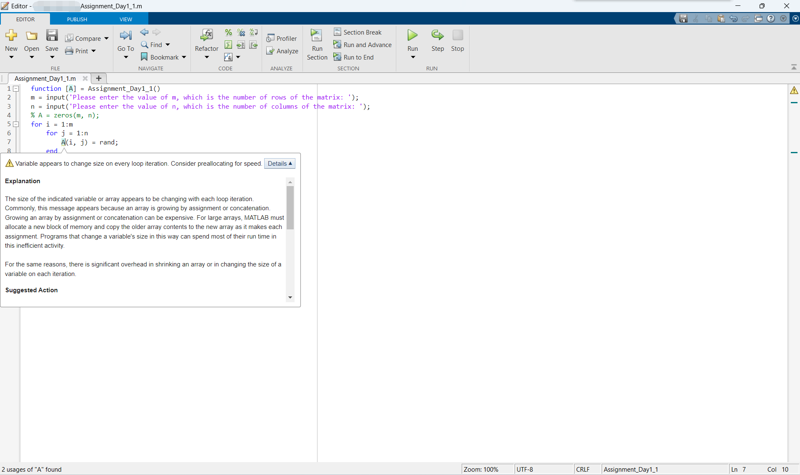
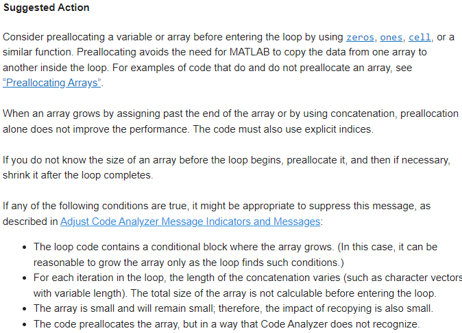
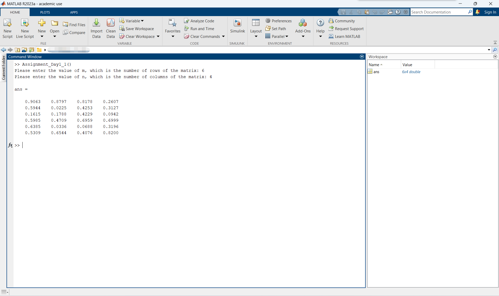
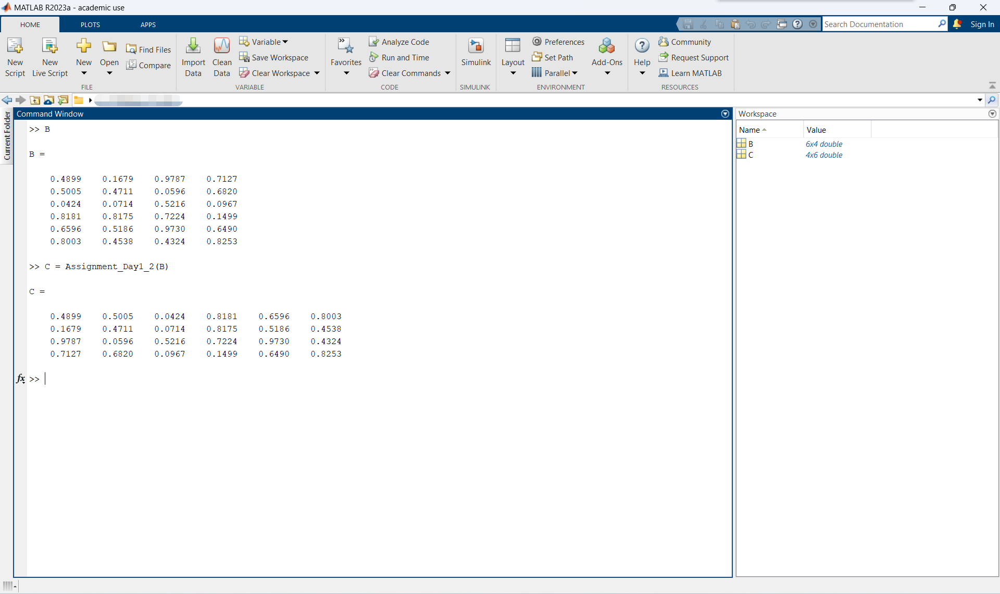
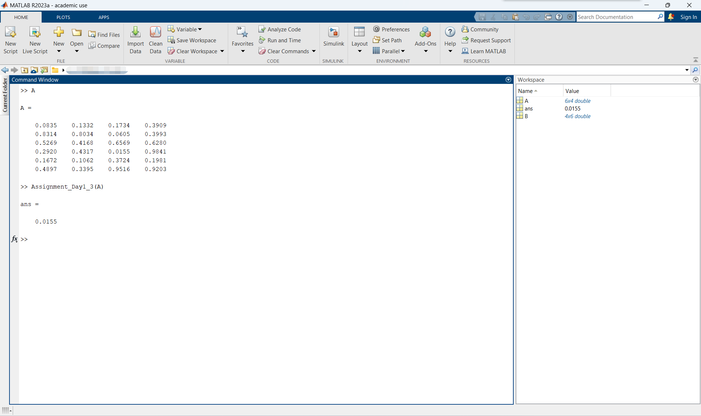
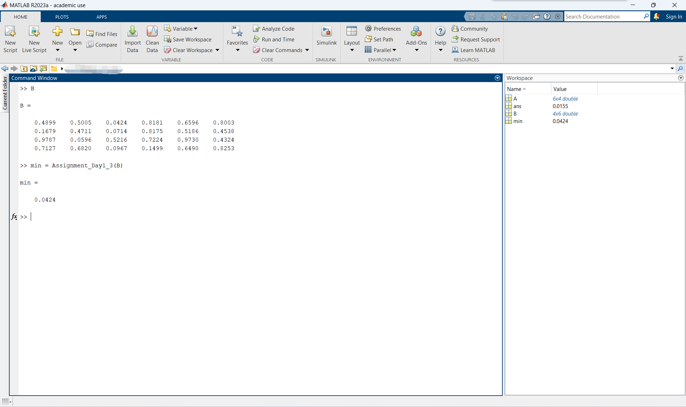
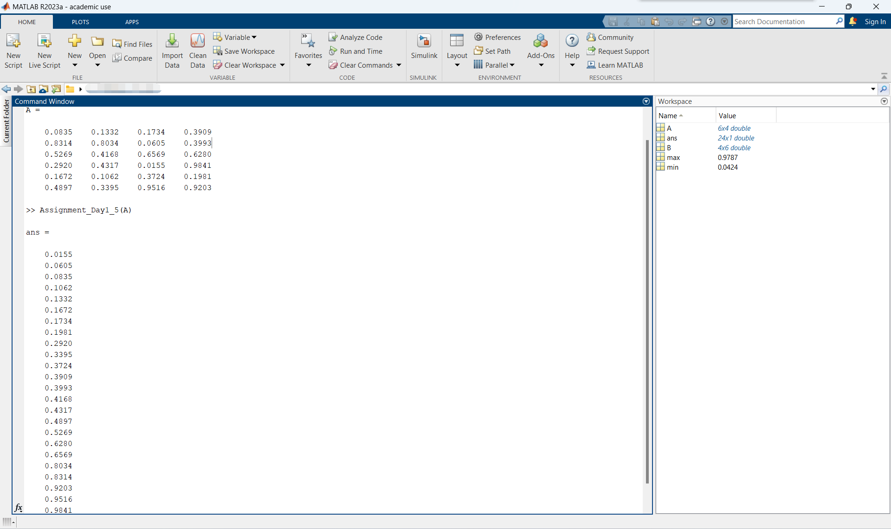
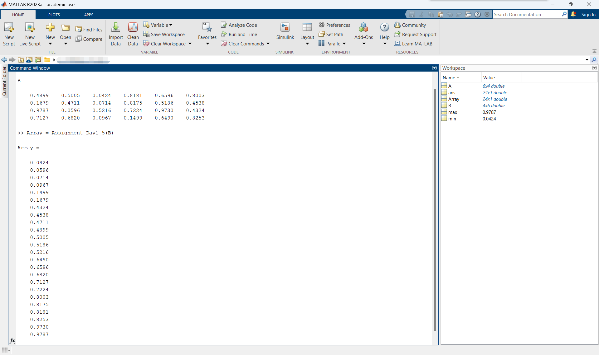

# MATLAB实验报告（一）

```
学号：
姓名：
实验时间：
实验地点：
```

本次实验作业如下：

> 编写实现如下脚本代码：
> 
> （1）随机生成一个大小为m、n的二维矩阵（m和n的值在命令行中输入）；
> 
> （2）编写求取该矩阵的转置矩阵的函数并调用输出结果；
> 
> （3）编写寻找矩阵中最小值的函数并调用输出结果；
> 
> （4）编写寻找矩阵中最大值的函数并调用输出结果；
> 
> （5）编写对矩阵中所有元素排序的函数，并调用输出排序结果。
> 
> 备注：不准调用MATLAB中与上述功能相关的自有函数。
> 
> 随机生成可以用`rand`函数。

上述（1）~（5）分别在[Assignment_Day1_1.m](./Assignment_Day1_1.m)，[Assignment_Day1_2.m](./Assignment_Day1_2.m)，[Assignment_Day1_3.m](./Assignment_Day1_3.m)，[Assignment_Day1_4.m](./Assignment_Day1_4.m)和[Assignment_Day1_5.m](./Assignment_Day1_5.m)中实现。

## Assignment_Day1_1.m

### 源代码

```matlab
function [A] = Assignment_Day1_1()
m = input('Please enter the value of m, which is the number of rows of the matrix: ');
n = input('Please enter the value of n, which is the number of columns of the matrix: ');
A = zeros(m, n);
for i = 1:m
    for j = 1:n
        A(i, j) = rand;
    end
end
end
```

### 函数说明

该函数没有参数，但是需要从命令行中接受两个输入`m`和`n`，它们分别为矩阵的行数和列数。该函数返回一个输出，为一个`m`行`n`列的随机矩阵。

<a id = "1"></a>
值得注意的是，在上述源代码中，在接收`m`、`n`的输入之后，开始调用`rand`函数生成矩阵的每个元素之前，我使用了这一句话：

```matlab
A = zeros(m, n);
```

这句话相当于提前声明了一个`m`行`n`列的矩阵并将其所有元素均初始化成`0`。

这句话在本函数中并不是必须的，如果违反`不准调用MATLAB中与上述功能相关的自有函数`的备注要求，将之直接删掉即可，并不影响运行结果。

使用这句话的目的是消除如下警告：



参考解决方法如下：



### 运行说明

采用MATLAB基本函数调用方法调用`Assignment_Day1_1`函数即可。

示例一：

```matlab
Assignment_Day1_1()
```

示例二：

```matlab
A = Assignment_Day1_1()
```

### 运行结果截图




## Assignment_Day1_2.m

### 源代码

```matlab
function [B] = Assignment_Day1_2(A)
[cols, rows] = size(A);
B=zeros(rows, cols);
for i = 1:rows
    for j = 1:cols
        B(i, j) = A(j, i);
    end
end
end
```

### 函数说明

该函数接受一个矩阵作为输入，返回输入矩阵的转置矩阵作为输出。

### 运行说明

采用MATLAB基本函数调用方法调用`Assignment_Day1_2`函数即可。

示例一：

```matlab
Assignment_Day1_2(A)
```

示例二：

```matlab
C = Assignment_Day1_2(B)
```

### 运行结果截图




## Assignment_Day1_3.m

### 源代码

```matlab
function [min] = Assignment_Day1_3(A)
[rows, cols] = size(A);
min = realmax;
for i = 1:rows
    for j = 1:cols
        if A(i, j) < min
            min = A(i, j);
        end
    end
end
end
```

### 函数说明

该函数接受一个矩阵作为输入，返回输入矩阵的所有元素中的最小值（唯一）作为输出。

在本函数中，我使用了`size`函数以确定输入矩阵的行数和列数。

输入矩阵的行数和列数将用于下面的循环控制。

本函数的思路就是：遍历矩阵的所有元素，用`min`变量记录当前最小值。如果遇到更小的，就更新`min`。

我将`min`初始化成了`realmax`（可用的最大实数）以确保函数能够正常工作。

另外一种方法是将`min`设为输入矩阵的第一行第一列的元素（即`A(1, 1)`）。采用此法可以避免使用`realmax`常数。

### 运行说明

采用MATLAB基本函数调用方法调用`Assignment_Day1_3`函数即可。

示例一：

```matlab
Assignment_Day1_3(A)
```

示例二：

```matlab
min = Assignment_Day1_3(B)
```

### 运行结果截图





## Assignment_Day1_4.m

### 源代码

```matlab
function [max] = Assignment_Day1_4(A)
[rows, cols] = size(A);
max = realmin;
for i = 1:rows
    for j = 1:cols
        if A(i, j) > max
            max = A(i, j);
        end
    end
end
end
```

### 函数说明
<a id = "2"></a>
该函数接受一个矩阵作为输入，返回输入矩阵的所有元素中的最大值（唯一）作为输出。

在本函数中，我使用了`size`函数以确定输入矩阵的行数和列数。

输入矩阵的行数和列数将用于下面的循环控制。

本函数的思路就是：遍历矩阵的所有元素，用`max`变量记录当前最大值。如果遇到更大的，就更新`max`。

我将`max`初始化成了`realmin`（可用的最小实数）以确保函数能够正常工作。

另外一种方法是将`max`设为输入矩阵的第一行第一列的元素（即`A(1, 1)`）。采用此法可以避免使用`realmin`常数。

### 运行说明

采用MATLAB基本函数调用方法调用`Assignment_Day1_4`函数即可。

示例一：

```matlab
Assignment_Day1_4(A)
```

示例二：

```matlab
max = Assignment_Day1_4(B)
```

### 运行结果截图


## Assignment_Day1_5.m

### 源代码

```matlab
function [array] = Assignment_Day1_5(A)
[rows, cols] = size(A);
array = zeros(rows*cols, 1);
for i = 1:rows*cols
    min = realmax;
    for j = 1:rows
        for k = 1:cols
            if A(j, k) < min
                min = A(j, k);
                min_a = j;
                min_b = k;
            end
        end
    end
    array(i, 1) = min;
    A(min_a, min_b) = realmax;
end
end
```

### 函数说明

该函数接受一个矩阵作为输入，将矩阵中所有元素依**从小到大**的顺序排成**一列**后返回一个**列向量**作为输出。

在本函数中，我使用了`size`函数以确定输入矩阵的行数和列数。

输入矩阵的行数和列数将用于下面的循环控制。

本函数需要一个以`输入矩阵的元素个数`为行数，`1`为列数的矩阵作为输出。

由于和[Assignment_Day1_1.m](#1)一样的原因（这里不再赘述），我调用了`zeros`函数。

本函数的思路就是：对于输出矩阵中的每个位置，先按照[Assignment_Day1_4.m](#2)中的思路遍历整个输入矩阵，找到输入矩阵中的最小值，并同步记下最小值所在的位置。然后将找到的最小值放在输出矩阵的当前位置上，并将输入矩阵的最小值所在的位置赋值成`realmax`（相当于标记删除，避免再次找到它）。就这样遍历整个输出矩阵即可。

使用`min`变量记下当前输入矩阵中的最小值。每次重新遍历输入矩阵之前，都要将`min`重置成`realmax`以确保函数能够产生正确结果。

显然，将本函数所得到的结果反序输出，即是**从大到小**的顺序。

本函数采用**列向量**而非行向量输出的原因很单纯：列向量可以更清晰地显示在屏幕上。

### 运行说明

采用MATLAB基本函数调用方法调用`Assignment_Day1_5`函数即可。

示例一：

```matlab
Assignment_Day1_5(A)
```

示例二：

```matlab
Array = Assignment_Day1_5(B)
```

### 运行结果截图




