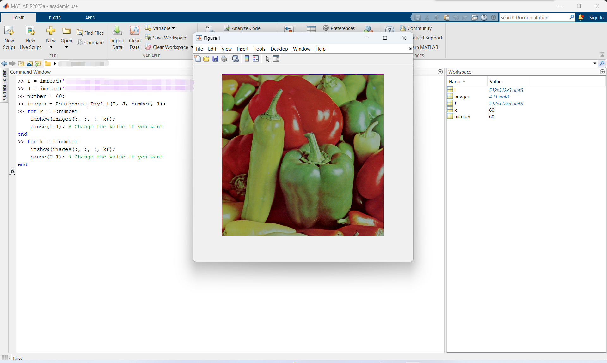
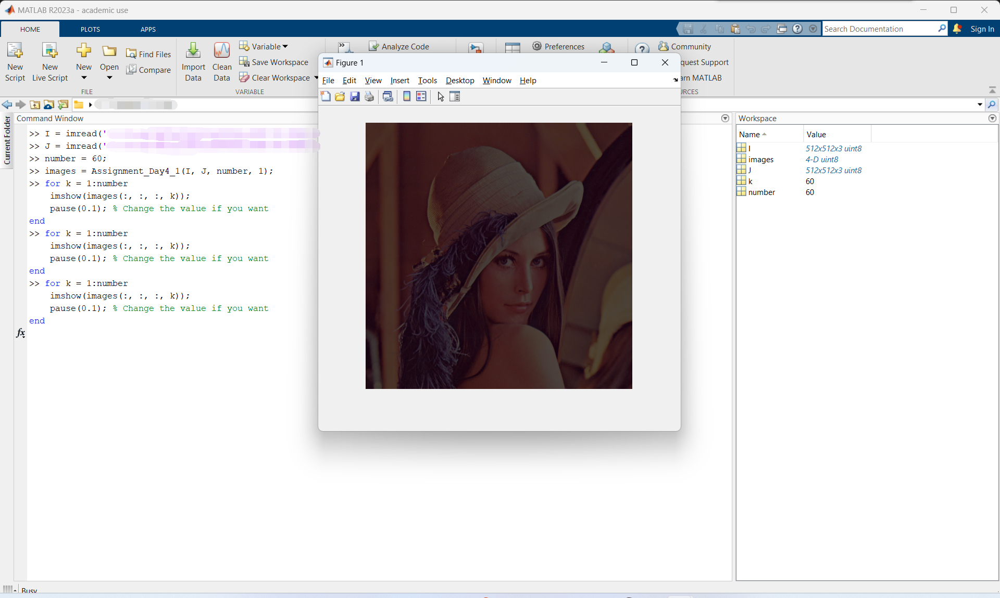
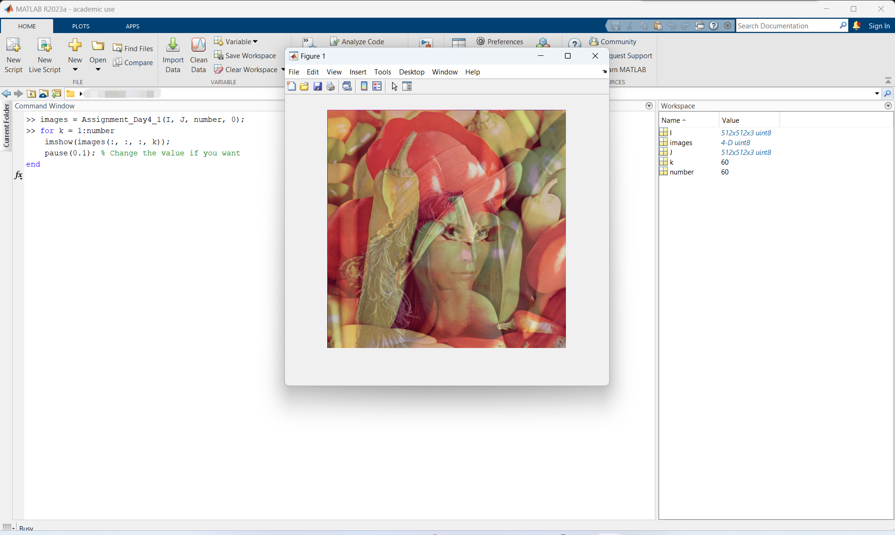
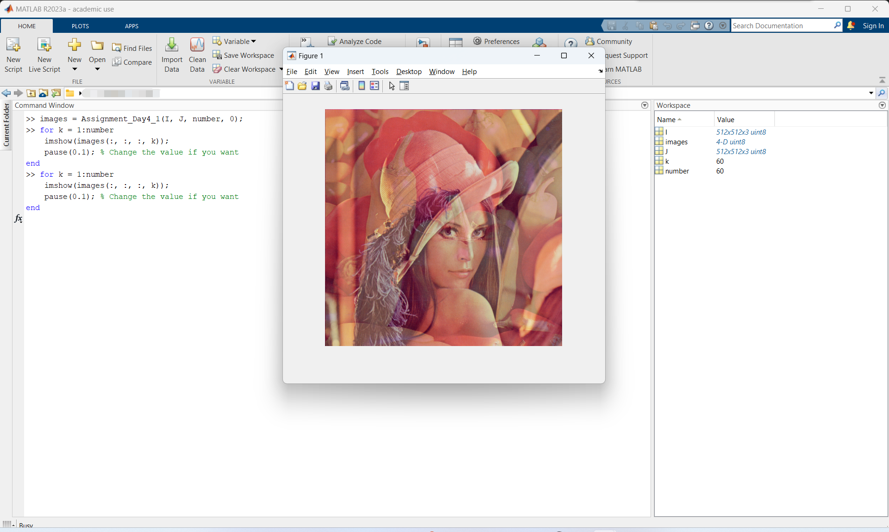
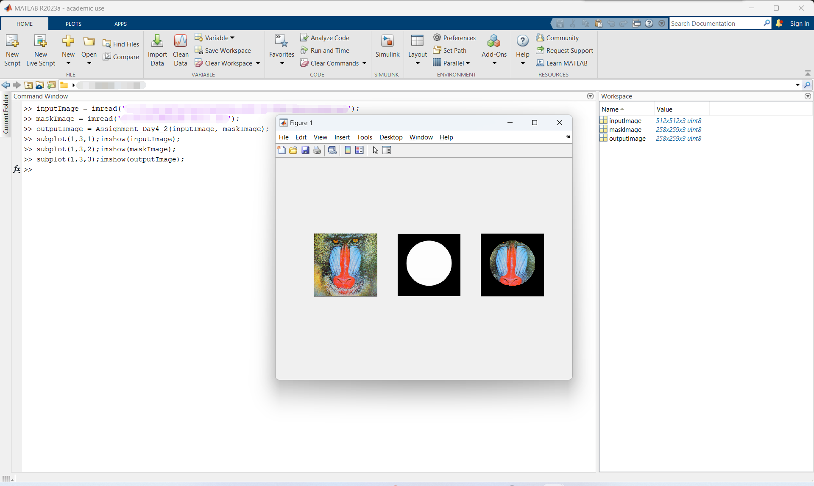

# MATLAB实验报告（三）

```
学号：
姓名：
实验时间：
实验地点：
```

本次实验作业如下：

> 编写matlab脚本实现如下功能，二选一：
> 
> （1）编写一个函数实现图像缩放功能，函数输入为原始图像和缩放系数，输出为缩放后图像数据
> 
> （2）编写代码实现如下功能：
> 
>       1）编写一个函数实现镜头切换时的淡入淡出效果，输入为两张图像及过渡帧数，输出为一组图像；
> 
>       2）编写一个函数实现图像的mask特效，输入为原始图像及mask图像，输出为特效图像。

**我选择完成（2）。**

上述1）和2）分别在文件[Assignment_Day4_1.m](./code/Assignment_Day4_1.m)和[Assignment_Day4_2.m](./code/Assignment_Day4_2.m)中实现。

## Assignment_Day4_1.m

### 源代码

```matlab
function images = Assignment_Day4_1(image1, image2, number, option)
if option == 1
if size(image1) ~= size(image2)
    error('Input images must be of the same size.');
end
images = zeros([size(image1), number], 'like', image1);
for i = 1:floor(number/2)
    factor = (i - 1) / (floor(number/2) - 1);
    images(:, :, :, i) = (1 - factor) * image1;
end
for i = 1:floor(number/2)
    factor = (i - 1) / (floor(number/2) - 1);
    images(:, :, :, i + floor(number/2)) = factor * image2;
end
images(:, :, :, number) = image2;
else
if size(image1) ~= size(image2)
    error('Input images must be of the same size.');
end
images = zeros([size(image1), number], 'like', image1);
for i = 1:number
    factor = (i - 1) / (number - 1);
    images(:, :, :, i) = (1 - factor) * image1 + factor * image2;
end
end
```

### 函数说明

该函数接收四个输入，传回一个输出。

四个输入依传入顺序分别为`image1`，`image2`，`number`和`option`。

`image1`和`image2`都是使用`imread`函数读入的图像，`number`是一个整数数字，`option`是数字控制变量，详述[见下](#5)。

该函数传回的输出是一个四维矩阵，实际上是一系列的图像（或者说是一组图像）。你可以通过`imshow(images(:, :, :, k));`语句来显示`images`中的第`k`张图像。
<a id="5"></a>
当控制变量`option`是`1`时，本函数将实现以下过程（下文将简称为“淡出淡入”）：从`image1`图像（下面我将称之为“始图”）先逐渐变为全黑（淡出），再从全黑逐渐变为`image2`图像（下面我将称之为“终图”），或者简单将这个过程描述为：从始图淡出，然后逐渐淡入到终图。整个过程由`number`张图像组成，亦即`images`中包含`number`张图像，所以`number`也称“帧数”。

下面来具体阐释函数的实现：

本淡入淡出过程要求始图和终图“一样大”，亦即`size`值相等。

本函数首先进行判断。如果始图和终图不一样大，则报错。

接下来，本函数由两部分组成，分别是淡出和淡入。每个部分都通过一个`for`循环实现。

首先用前一半的帧数实现淡出。

定义了一个因子`factor = (i - 1) / (floor(number/2) - 1);`，其中`i`在`[1, floor(number/2)]`中逐一递增。通过这样的定义，可以由在`[1, floor(number/2)]`中变化的`i`构造出在`[0, 1]`中**均匀**变化（`floor(number/2)`次）的`factor`。于是`1 - factor`从`1`到`0`均匀变化（`floor(number/2)`次）。使用乘法：`images(:, :, :, i) = (1 - factor) * image1;`，确保了`images`中的前`floor(number/2)`张图像存储的是始图`image1`亮度均匀递减至全黑的过程。至此实现淡出。

然后用后一半的帧数实现淡入。

和淡出过程定义同样的因子`factor`。`factor`在`[0, 1]`中**均匀**变化（`floor(number/2)`次）。同样用乘法：`images(:, :, :, i + floor(number/2)) = factor * image2;`，确保了`images`中的后`floor(number/2)`张图像存储的是从全黑亮度均匀递增至显示终图`image2`的过程。至此实现淡入。

到此为止，实际上就已经实现了淡出淡入的过程，但是为什么最后还有一句`images(:, :, :, number) = image2;`呢？前面表达“前一半”和“后一半”的时候为什么反复使用`floor`函数呢？

这些其实都是因为`number`。

我们在描述“前一半”和“后一半”的时候，其实默认了`number`可以被分为两半。但是如果`number`为奇数，它就不能通过简单的`/2`操作分为两半，这也是上面一直使用`floor`函数的原因。

如果`number`是偶数，那么整个函数实现过程中使用的所有`floor`函数都没有任何意义，而且最后一句`images(:, :, :, number) = image2;`也没有意义（因为在经过第二个`for`循环之后，`images(:, :, :, number)`中本来存储的就已经是终图`image2`了。

但是当`number`为奇数时，所有`floor`函数就都发挥出来了它的作用。两个`for`循环都采用了`floor`，这将导致两次循环后的值“磨损”了`1`（其实完全可以在第二个`for`循环中采用`ceil`，这样不仅避免了磨损问题，还避免了下面所述的[重复帧](#2)问题。这完全可以作为一个[优化](#3)<a id="1"></a>），也就是说，在经过两个`for`循环之后，`images`中只有`number - 1`张图像。为了填补最后一帧，才有了`images(:, :, :, number) = image2;`。

值得注意的是，当`number`为奇数时，我们实际上只用了`number - 1`帧就已经完成了淡出淡入。但是为了凑足`number`帧，我们强行在后面添加了一帧终图。需要指出是，在这种情况下，`images`中的最后一帧和倒数第二帧实际上是完全一样的，也即出现了**重复帧**<a id="2"></a>问题。但是一帧上，人眼几乎无法区分，于是我们的函数是可以接受的。

如果想避免重复帧问题，如[前文](#1)所述，我们只需要在第一个`for`循环中都使用`floor`函数，在第二个`for`循环中都使用`ceil`函数即可（版本1）。当然，也可以在第一个`for`循环中都使用`ceil`函数，在第二个`for`循环中都使用`floor`函数（版本2）。下面分别给出两个版本的优化：<a id="3"></a>

版本1：

```matlab
function images = Assignment_Day4_1(image1, image2, number, option)
if option == 1
if size(image1) ~= size(image2)
    error('Input images must be of the same size.');
end
images = zeros([size(image1), number], 'like', image1);
for i = 1:floor(number/2)
    factor = (i - 1) / (floor(number/2) - 1);
    images(:, :, :, i) = (1 - factor) * image1;
end
for i = 1:ceil(number/2)
    factor = (i - 1) / (ceil(number/2) - 1);
    images(:, :, :, i + floor(number/2)) = factor * image2;
end
else
... % Original content in the original function
end
end
```

版本2：

```matlab
function images = Assignment_Day4_1(image1, image2, number, option)
if option == 1
if size(image1) ~= size(image2)
    error('Input images must be of the same size.');
end
images = zeros([size(image1), number], 'like', image1);
for i = 1:ceil(number/2)
    factor = (i - 1) / (ceil(number/2) - 1);
    images(:, :, :, i) = (1 - factor) * image1;
end
for i = 1:floor(number/2)
    factor = (i - 1) / (floor(number/2) - 1);
    images(:, :, :, i + ceil(number/2)) = factor * image2;
end
else
... % Original content in the original function
end
end
```

当控制变量`option`不是`1`时，本函数将实现以下过程：从始图逐渐变化成终图（下文将简称为“过渡”）。始图越来越淡，终图则越来越清晰。整个过程由`number`张图像组成。

这个过程比[上面的淡出淡入](#5)更加简单。

首先依旧是确保`size`一样大。

然后用一个`for`循环即可。

通过`factor = (i - 1) / (number - 1);`语句定义在`[0, 1]`中**均匀**变化（`number`次）的`factor`因子，然后使用乘法`images(:, :, :, i) = (1 - factor) * image1 + factor * image2;`实现由`image1`经`number`帧逐渐变为`image2`的过程。

### 运行说明

采用MATLAB基本函数调用方法调用`Assignment_Day4_1`函数即可。

示例一（过渡）：

```matlab
images = Assignment_Day4_1(I, J, number, 0);
```

示例二（淡出淡入）：

```matlab
images = Assignment_Day4_1(I, J, number, 1);
```

你可以使用如下代码查看效果：

```matlab
for k = 1:number
    imshow(images(:, :, :, k));
    pause(0.1); % Change the value if you want
end
```

该`for`循环将以0.1s/帧的速度（可修改为其他值）“播放”`images`中的图像。这使得我们可以动态、直观的查看到`Assignment_Day4_1`函数的效果。


### 运行结果截图

#### 淡出淡入





[点击此处下载演示视频](https://github.com/cmw15004431816/MATLAB/blob/main/img/1.mp4?raw=true)

#### 过渡





[点击此处下载演示视频](https://github.com/cmw15004431816/MATLAB/blob/main/img/2.mp4?raw=true)

## Assignment_Day4_2.m

### 源代码

```matlab
function outputImage = Assignment_Day4_2(inputImage, maskImage)
if size(maskImage, 3) == 3
   maskImage = rgb2gray(maskImage);
end
binaryMask = imbinarize(maskImage);
[maskHeight, maskWidth] = size(binaryMask);
resizedImage = imresize(inputImage, [maskHeight, maskWidth]);
if size(resizedImage, 3) == 3
   binaryMask = repmat(binaryMask, [1, 1, 3]);
end
if size(resizedImage) ~= size(binaryMask)
   error('Resized image and mask image must be of the same size.');
end
outputImage = uint8(double(resizedImage) .* double(binaryMask));
end
```

### 函数说明

该函数接收两个矩阵（实际上是两张图像）作为参数，并返回一个（图像）矩阵输出。（该函数的输出可以直接作为`imshow`函数的输入去显示图像）

`inputImage`是输入的图像，`maskImage`是mask图像，`outputImage`是在`inputImage`的基础上应用了`maskImage`的mask特效后得到的图像。

该函数首先接收`maskImage`输入，并将这张图像转换为二值图像。

函数的核心操作只有一句话：`outputImage = uint8(double(resizedImage) .* double(binaryMask));`。这句话主要操作是：将经过`resize`处理后的原图像与二值的`binaryMask`按位相乘。如此即可得到mask效果之后的图像。

另外，如果原图像是RGB图像，则需要在R、G、B三个通道上都分别做上述乘法。

并且，如果`inputImage`的大小与`maskImage`不同，将把它`resize`成`maskImage`的大小。

我采用的`maskImage`是课件中给出的图像：


### 运行说明

采用MATLAB基本函数调用方法调用`Assignment_Day4_2`函数即可。

示例：

```matlab
outputImage = Assignment_Day4_2(inputImage, maskImage);
```

### 运行结果截图


