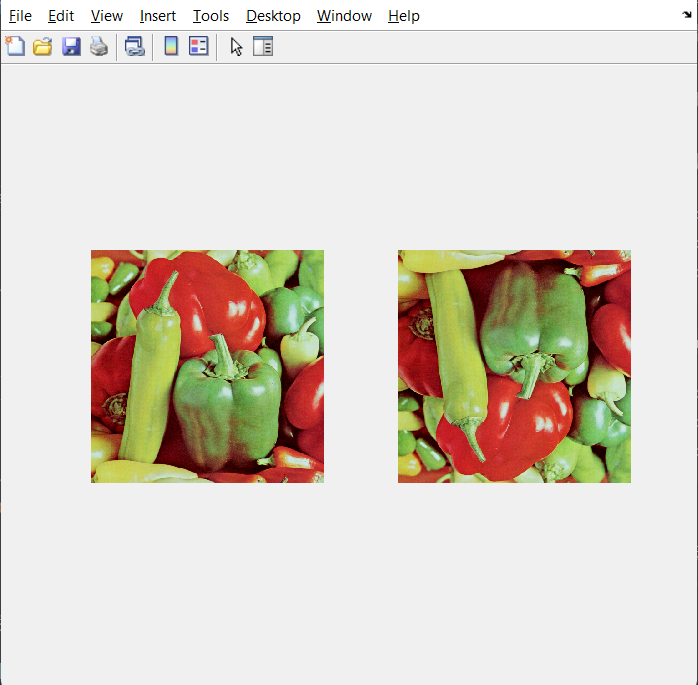
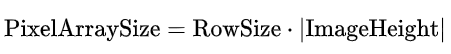

# MATLAB实验报告（二）

```
学号： 
姓名： 
实验时间： 
实验地点： 
```

本次实验作业如下：

> 编写matlab脚本实现如下功能：
>
> （1）读入一张真彩色图像；
>
> （2）编写matlab函数实现真彩色->灰度图像的转换并调用输出结果，保存为新图像文件；
>
> （3）编写matlab函数统计一张灰度图像中每一个像素值的数量并输出二维统计图形。
>
> （4）编写matlab函数实现真彩色->二值图像的转换并调用输出结果，保存为新图像文件；
>
> （5）编写matlab函数统计一张二值图像中的0/1像素数量并输出二维统计图形；
>
> 备注：不准调用matlab中与上述功能相关的自有函数。

上述（1）~（5）分别在文件[Assignment_Day2_1.m](./code/Assignment_Day2_1.m)，[Assignment_Day2_2.m](./code/Assignment_Day2_2.m)，[Assignment_Day2_3.m](./code/Assignment_Day2_3.m)，[Assignment_Day2_4.m](./code/Assignment_Day2_4.m)和[Assignment_Day2_5.m](./code/Assignment_Day2_5.m)中实现。

## Assignment_Day2_1.m

### 源代码

```matlab
function [I] = Assignment_Day2_1(filename)
    file = fopen(filename, 'r');
    if file == -1
        error('Cannot open file: %s', filename);
    end
    fseek(file, 18, 'bof');
    width = fread(file, 1, 'int32');
    height = fread(file, 1, 'int32');
    fseek(file, 2, 'cof');
    bitDepth = fread(file, 1, 'int16');
    if bitDepth ~= 24
        error('Only 24-bit BMP files are supported.');
    end
    rowSize = floor((bitDepth * width + 31) / 32) * 4;
    dataSize = rowSize * height;
    fseek(file, 54, 'bof');
    rawData = fread(file, dataSize, 'uint8');
    fclose(file);
    I = reshape(rawData, [rowSize, height]);
    I = I(1:width*3, :);
    I = permute(reshape(I, [3, width, height]), [3, 2, 1]);
    I = uint8(I);
    I = flipud(I);
    I = I(:, :, [3, 2, 1]);
end
```

### 函数说明

该函数接收一个字符串作为参数，该字符串是所要读入的真彩色图像的绝对路径。该函数返回一个输出，为读入的真彩色图像所对应的矩阵。（该函数的输出可以直接作为`imshow`函数的输入去显示图像）

该函数的实现思路比较简单，但实现细节上较为复杂，涉及到了BMP图像的结构以及文件处理有关函数。下面我将首先说明一下实现细节，然后给出实现思路。

#### 实现细节

该函数中主要使用了如下函数：

- 流程控制类：`error`
- 数学运算类：`floor`
- 文件处理类：`fopen`，`fread`，`fseek`，`fclose`
- 图像（矩阵）处理类：`reshape`，`permute`，`flipud`，`unit8`

我将分别解释以上函数。

- `error`

  本函数用于报错。当我们提供的参数（路径）不存在，或者我们无法读取，抑或是图片格式不正确时，我们都将使用`error`函数抛出错误。

- `floor`
  
  无需解释，数学运算的下取整函数。至于为什么要用到此函数，请参考[此处](#1)。

- `fopen`
  
  文件打开函数，与C语言类似。本函数中用到的为`file = fopen(filename, 'r');`，表示以只读方式打开文件`filename`，产生的文件指针为`file`。调用`fopen`函数时，如果打开失败，则将回传`-1`。

- `fread`
  
  文件读取函数，与C语言类似。它的功能是从指定文件（指针）中读取指定数量的指定类型数据。举例如下：`width = fread(file, 1, 'int32');`表示从文件指针`file`中读取`1`个`int32`类型的数据，并将该数据储存到`width`里。

- `fseek`
  
  文件查找函数，或者说是文件指针移动（定位）函数，与C语言类似。它的功能是改变文件指针指向的位置。下面通过两个例子来阐述它的作用：`fseek(file, 18, 'bof');`此句将文件指针`file`指向距离文件开始`18`字节处的位置；`fseek(file, 2, 'cof');`此句将文件指针`file`指向当前位置后面`2`字节处的位置。

  关于`fseek`函数的第三个参数，有`bof`，`cof`和`eof`三个选择，分别表示`beginning of the file（文件开始）`，`current position of the file（当前位置）`和`end of the file（文件结尾）`。

- `fclose`
  
  文件关闭函数，与C语言类似。`fclose(file);`关闭`file`文件。

- `reshape`
  
  在不改变原有数据的条件下将数据重新存储。例如：`I = reshape(rawData, [rowSize, height]);`将`rawData`中的数据重新存为`rowSize * height`的矩阵并赋值给`I`。
  
  我们知道，图片是以二维矩阵的形式存储的。所以从文件中直接读取出来的`rawData`不能直接使用，应该将之`reshape`成相应大小的矩阵。

- `permute`

  用于交换矩阵的维数。
  
  阐述如下：

  对于矩阵`A`，调用`permute`前：
  
  ```yml
  Dimension 1: Rows
  Dimension 2: Columns
  Dimension 3: Pages
  ```

  调用`B = permute(A, [3, 2, 1]);`后的`B`：

  ```yml
  Dimension 1: Pages (originally 3rd dimension of A)
  Dimension 2: Columns (same as the 2nd dimension of A)
  Dimension 3: Rows (originally 1st dimension of A)
  ```

- `flipud`
  
  此函数将整个矩阵翻转过来，即行的顺序与原序相反，列的顺序不变。

  反映到图像上，就是将图像上下翻转，如下图：

  

  至于为什么要调用此函数，请参考[此处](#3)。

- `unit8`
  
  将矩阵中的所有元素都转换为8位无符号整数。

  真彩色图像实际上已经保证矩阵中的所有元素都是8位无符号整数，使用此函数只是为了保险。

#### 实现思路

该函数首先根据传入的参数去寻找要打开的图片文件并执行打开操作。

如果打开失败，则报错。

然后定位到图片的宽度和高度的位置[^1]，先读取宽度，再读取高度。

随后定位到`bitDepth`处并读取[^1]。如果`bitDepth`不为24（8位R，8位G，8位B），则说明该图像不是我们要处理的标准真彩色图像，此时报错。

然后开始计算`rowSize`和`dataSize`，计算公式为：
<a id="1"></a>
[](https://en.wikipedia.org/wiki/BMP_file_format#Pixel_storage)

[](https://en.wikipedia.org/wiki/BMP_file_format#Pixel_storage)

> 注：本函数中采取了上图中的第二个式子计算`rowSize`，这也是使用到`floor`函数的原因。

然后定位到图片信息处，开始读取。

至此已获取文件中的所有必要信息，关闭文件。

随后将读取到的图片信息`reshape`成相应大小的矩阵。

由于直接从文件中读取到的信息中含有无用信息（Padding bytes[^2]），使用`I = I(1:width*3, :);`将之去除。

使用`I = permute(reshape(I, [3, width, height]), [3, 2, 1]);`处理图像，使之符合MATLAB的图像格式[^3]。

转成无符号8位整数。

<a id="3"></a>
至此，基本的处理已经结束，但此时如果调用`imshow`函数会发现，我们读入的图片上下颠倒[^4]，并且颜色相反[^5]（即为反片）。

于是进行修复：调用`I = flipud(I);`来上下翻转；调用`I = I(:, :, [3, 2, 1]);`来将原先的B，G，R交换回R，G，B。

至此处理完毕。

[^1]: 参考链接： https://en.wikipedia.org/wiki/BMP_file_format#DIB_header_(bitmap_information_header)

[^2]: 参考链接: https://en.wikipedia.org/wiki/BMP_file_format#Pixel_array_(bitmap_data)

[^3]: 参考链接： https://www.mathworks.com/help/matlab/creating_plots/image-types.html#mw_6c8c1e87-44e4-42d6-9953-b65f2b8f905a

[^4]: [The pixel array is a block of 32-bit DWORDs, that describes the image pixel by pixel. Usually pixels are stored "bottom-up", starting in the lower left corner, going from left to right, and then row by row from the bottom to the top of the image.](https://en.wikipedia.org/wiki/BMP_file_format#Pixel_array_(bitmap_data))

[^5]: [A 24-bit bitmap with Width=1, would have 3 bytes of data per row (blue, green, red) and 1 byte of padding, while Width=2 would have 6 bytes of data and 2 bytes of padding, Width=3 would have 9 bytes of data and 3 bytes of padding, and Width=4 would have 12 bytes of data and no padding.](https://en.wikipedia.org/wiki/BMP_file_format#Pixel_array_(bitmap_data))

### 运行说明

采用MATLAB基本函数调用方法调用`Assignment_Day2_1`函数即可。

示例：

```matlab
I = Assignment_Day2_1('C:\your\path\to\the\bmp\image\image.bmp');
```

### 运行结果截图


## Assignment_Day2_2.m

### 源代码

```matlab
function [J] = Assignment_Day2_2(I)
    R = I(:,:,1);
    G = I(:,:,2);
    B = I(:,:,3);
    J = 0.299 * R + 0.587 * G + 0.114 * B;
    J = uint8(J);
    imwrite(J, 'output.bmp');
end
```

### 函数说明

该函数接收一个矩阵（实际上是读入的真彩色图像）作为参数，并返回一个输出，为读入的真彩色图像转换成灰度图像后所对应的矩阵。（该函数的输出可以直接作为`imshow`函数的输入去显示图像）

本函数由两部分组成——转换和保存。

其中转换部分只需要按照如下公式计算即可。

[](https://en.wikipedia.org/wiki/Grayscale#Luma_coding_in_video_systems)

保存部分直接调用`imwrite`函数，将转换后所得到的图像命名为`output.bmp`并保存到当前工作目录下。

### 运行说明

采用MATLAB基本函数调用方法调用`Assignment_Day2_2`函数即可。

示例：

```matlab
J = Assignment_Day2_2(I);
```

### 运行结果截图


<a id="2"></a>

## Assignment_Day2_3.m

### 源代码

```matlab
function Assignment_Day2_3(I)
if size(I, 3) ~= 1
    error('Input image must be a grayscale image.');
end
Counter = zeros(256, 1);
for i = 0:255
    Counter(i + 1) = sum(I(:) == i);
end
    figure;
    bar(0:255, Counter, 'BarWidth', 1, 'FaceColor', 'k');
    title('Pixel Value Histogram');
    xlabel('Pixel Value');
    ylabel('Count');
    xlim([0 255]);
    grid on;
end
```

<a id="4"></a>

### 函数说明

该函数接收一个矩阵（实际上是读入的灰度图像）作为参数，没有输出。

本函数由两部分组成——统计和画图。

在开始之前，函数首先进行了检查。如果发现输入不是灰度图像，则报错。

其中统计部分是一个循环。

首先初始化一个`256 * 1`的向量用于储存结果，初始值均为0。

用`I(:) == i`构造`相等判断向量`，调用`sum`对该向量求和，即得到矩阵`I`中值为`i`的元素的个数。遍历从`0`到`255`的所有`i`，将每次的统计结果存入我们初始化的`Counter`向量。遍历结束后，`Counter`中将存有灰度图像`I`中每一个像素值的数量。

接下来只需要根据`Counter`画图，输出二维统计图形即可。

画图部分十分简单，不予说明。

我的画图部分绘制了一张柱状图。

### 运行说明

采用MATLAB基本函数调用方法调用`Assignment_Day2_3`函数即可。

示例：

```matlab
Assignment_Day2_3(I);
```

### 运行结果截图


## Assignment_Day2_4.m

### 源代码

```matlab
function [J] = Assignment_Day2_4(I)
K = Assignment_Day2_2(I);
level = 128;
J = K > level;
imwrite(J, 'output.bmp');
end
```

### 函数说明

该函数接收一个矩阵（实际上是读入的真彩色图像）作为参数，并返回一个输出，为读入的真彩色图像转换成二值图像后所对应的矩阵。（该函数的输出可以直接作为`imshow`函数的输入去显示图像）

本函数调用了[Assignment_Day2_3.m](#2)，首先将真彩色图像转为灰度图像，然后指定`level`的值为`128`，并新建一个矩阵。如果该处像素值大于`level`，该元素赋值`1`，否则为`0`，这样就把灰度图转为了二值图。最后调用`imwrite`函数保存输出图像`output.bmp`到当前目录下。

### 运行说明

采用MATLAB基本函数调用方法调用`Assignment_Day2_4`函数即可。

示例：

```matlab
J = Assignment_Day2_4(I);
```

### 运行结果截图


## Assignment_Day2_5.m

### 源代码

```matlab
function Assignment_Day2_5(I)
if ~islogical(I) && ~ismember(unique(I), [0, 1])
        error('Input image must be a binary image with values 0 and 1.');
end
    count0 = sum(I(:) == 0);
    count1 = sum(I(:) == 1);
    count = [count0 count1];
    figure;
    bar([0, 1], count, 'BarWidth', 0.5, 'FaceColor', 'b');
    title('Pixel Value Counts in Binary Image');
    xlabel('Pixel Value');
    ylabel('Count');
    xticks([0 1]);
    xticklabels({'0 (Black)', '1 (White)'});
    grid on;
end
```

### 函数说明

本函数的思路与[Assignment_Day2_3](#4)的思路大致相同，且比它更加简单。

该函数接收一个矩阵（实际上是读入的二值图像）作为参数，没有输出。

本函数由两部分组成——统计和画图。

在开始之前，函数首先进行了检查。如果发现输入不是二值图像，则报错。

统计部分，只需要使用`(:)`和`sum`分别统计`0`和`1`即可，这比[Assignment_Day2_3](#4)更加简单，这里不再赘述。

画图部分，我绘制的是条形图。

### 运行说明

采用MATLAB基本函数调用方法调用`Assignment_Day2_5`函数即可。

示例：

```matlab
Assignment_Day2_5(I);
```

### 运行结果截图


