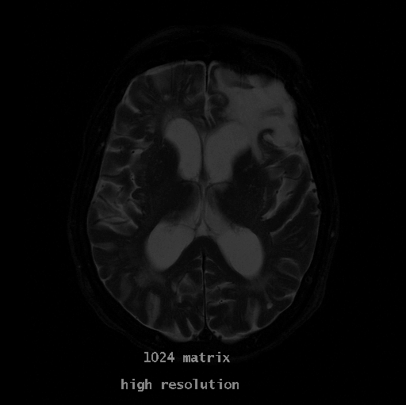
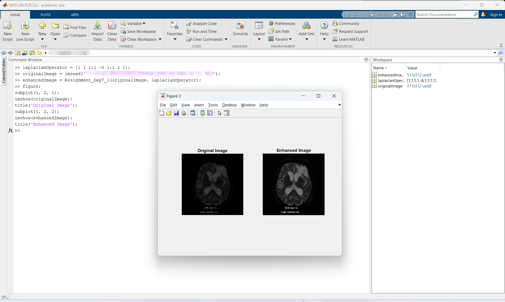
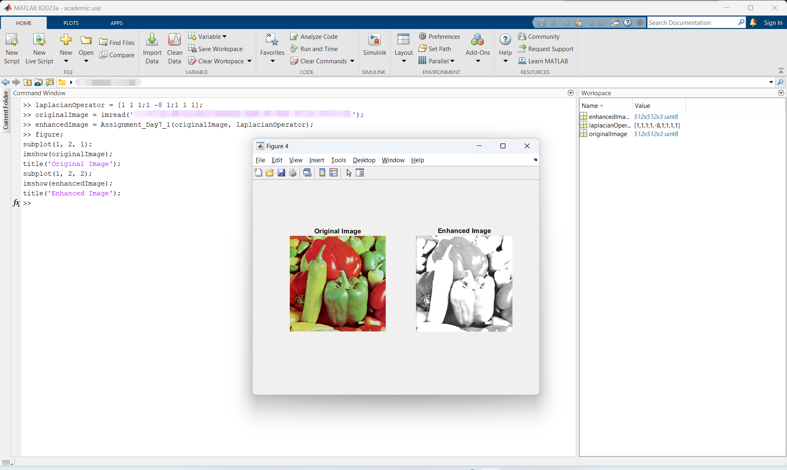
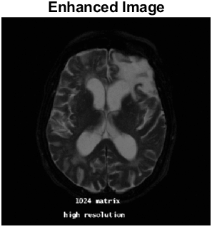
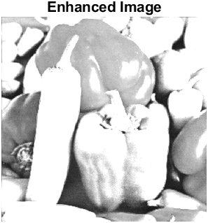

# MATLAB实验报告（五）

```
学号：
姓名：
实验时间：
实验地点：
```

本次实验作业如下：

> 编写代码实现：
> 
> 编写函数实现基于拉普拉斯算子的图像增强，输入为原始图像和某个自定义的拉普拉斯算子，输出为增强后的图像。

上述功能在[Assignment_Day7_1.m](./code/Assignment_Day7_1.m)中实现。

## Assignment_Day7_1.m

### 源代码

```matlab
function enhancedImage = Assignment_Day7_1(originalImage, laplacianOperator)
    if size(originalImage, 3) == 3
        grayImage = rgb2gray(originalImage);
    else
        grayImage = originalImage;
    end
    enhancedImage = grayImage;
    grayImage = double(grayImage);
    [imageHeight, imageWidth] = size(grayImage);
    [kernelHeight, kernelWidth] = size(laplacianOperator);
    padHeight = floor(kernelHeight / 2);
    padWidth = floor(kernelWidth / 2);
    paddedImage = padarray(grayImage, [padHeight, padWidth], 'replicate');
    laplacianImage = zeros(imageHeight, imageWidth);
    for i = 1:imageHeight
        for j = 1:imageWidth
            region = paddedImage(i:i+kernelHeight-1, j:j+kernelWidth-1);
            laplacianImage(i, j) = sum(sum(region .* laplacianOperator));
        end
    end
    minValue = min(laplacianImage(:));
    maxValue = max(laplacianImage(:));
    laplacianImage = laplacianImage - minValue;
    laplacianImage = 255 * (laplacianImage / (maxValue - minValue));
    laplacianImage = uint8(laplacianImage);
    enhancedImage = enhancedImage + laplacianImage;
    enhancedImage = mat2gray(enhancedImage);
    enhancedImage = uint8(enhancedImage * 255);
    if size(originalImage, 3) == 3
        enhancedImage = repmat(enhancedImage, [1 1 3]);
    end
end
```

### 函数说明

该函数接收两个输入，传回一个输出。 输入`originalImage`是要处理的原始图像矩阵，`laplacianOperator`是一个自定义的拉普拉斯算子，是一个矩阵；输出`enhancedImage`则是`originalImage`经过`laplacialOperator`增强后的图像矩阵。（可以直接调用`imshow`函数展示输出图像）

下面我将详细阐述该函数。

本函数只能处理灰度图。对于真彩色图像，我们会将其转换为灰度图像然后处理。所以第一步就是图像类型判断。确保接下来的处理是针对灰度图`grayImage`的。

首先初始化`enhancedImage`为`grayImage`。

然后将`grayImage`转换为`double`类型以便处理。

然后是一系列的初始化操作。

使用了`padarray`函数处理`grayImage`，方便后续循环移动。

到达`for`循环处开始进行处理。

核心是`laplacianImage(i, j) = sum(sum(region .* laplacianOperator));`，这一句实现了拉普拉斯图像像素值的计算。

随后开始**规约化**。

将拉普拉斯化得到的矩阵映射到`[0, 255]`上，再转换为`uint8`类型。

规约化的过程实际上是先映射到`[0, 1]`上，再乘以255映射到`[0, 255]`上。

然后是`enhancedImage = enhancedImage + laplacianImage;`，将拉普拉斯图像“加”到原图（`grayImage`）上，完成图像增强。

最后就是一些尾处理：

转成灰度图，映射回`[0, 255]`，转成`uint8`类型。

如果最开始传入的为真彩色图像，则输出三个通道，保证图像类型不变。但是必须指出的是，虽然最后返回的是三个通道的真彩色图像，但是原来图像的颜色信息已经完全损失，即使这时输出的`enhancedImage`具有三个通道，在显示出来时，它仍然是黑白图像。

### 运行说明

采用MATLAB基本函数调用方法调用`Assignment_Day7_1`函数即可。

示例：

```matlab
enhancedImage = Assignment_Day7_1(originalImage, laplacianOperator);
```

使用如下代码校验效果：

```matlab
figure;
subplot(1, 2, 1);
imshow(originalImage);
title('Original Image');
subplot(1, 2, 2);
imshow(enhancedImage);
title('Enhanced Image');
```

### 运行结果截图

我将以如下矩阵

```
    1	1	1
    1	-8	1
    1	1	1
```

为`laplacianOperator`进行演示。

即`laplacianOperator = [1 1 1;1 -8 1;1 1 1];`。

我演示使用的两张图像如下：



左图是灰度图，右图是真彩色图像。





从上两图中可以非常清晰地看出，经过我们的`Assignment_Day7_1`函数后，原来的输入图像得到明显增强。

附上两张增强图像如下：


