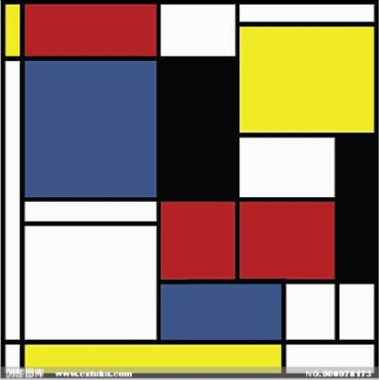
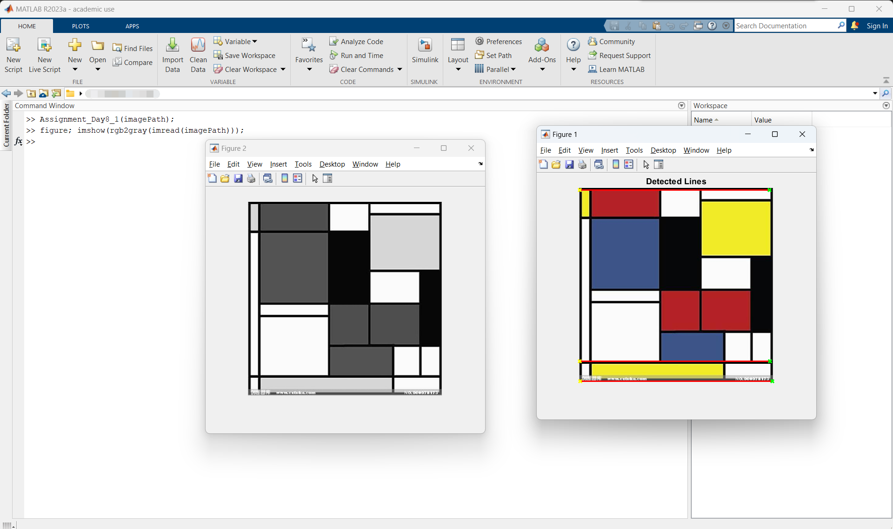
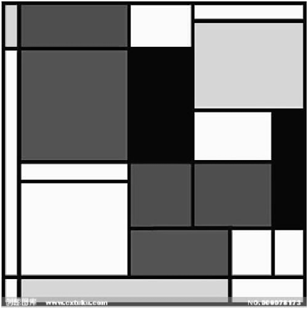
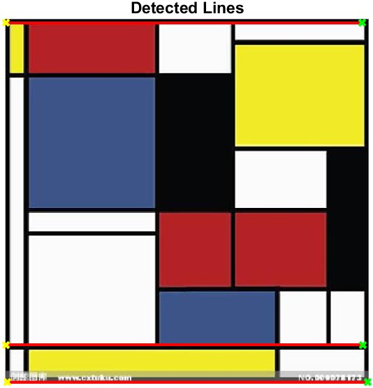
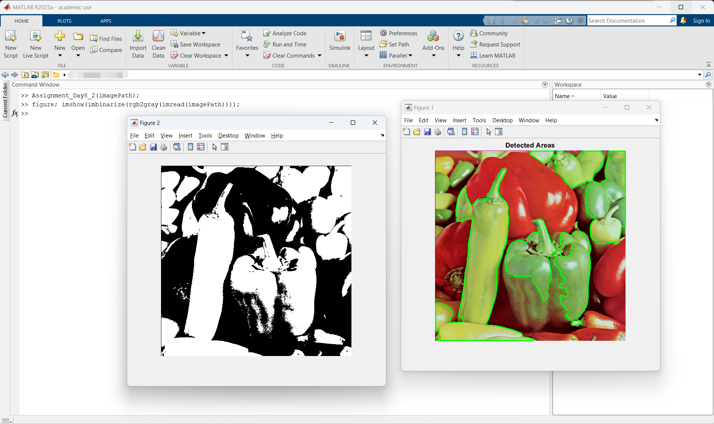
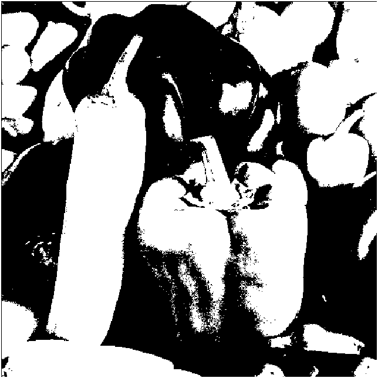
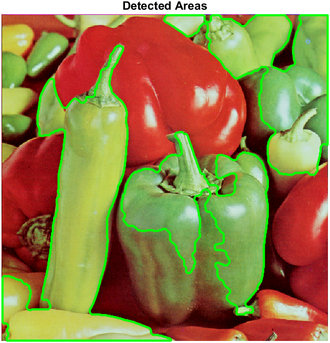

# MATLAB实验报告（六）

```
学号：
姓名：
实验时间：
实验地点：
```

本次实验作业如下：

> 任意给出一幅彩色图像，编写代码实现：
> 
> （1）利用Hough变换检测图像中最长的3条直线并且标记出来；
> 
> （2）利用matlab自带的边界跟踪函数标记出面积最大的3个区域。

上述功能分别在[Assignment_Day8_1.m](./code/Assignment_Day8_1.m)和[Assignment_Day8_2.m](./code/Assignment_Day8_2.m)中实现。

## Assignment_Day8_1.m

### 源代码

```matlab
function Assignment_Day8_1(imagePath)
    I = imread(imagePath);
    grayImage = rgb2gray(I);
    BW = edge(grayImage, 'canny');
    [H, T, R] = hough(BW);
    P = houghpeaks(H, 10, 'threshold', ceil(0.3 * max(H(:))));
    lines = houghlines(BW, T, R, P);
    figure, imshow(I), hold on
    title('Detected Lines');
    longestLines = struct('point1', {}, 'point2', {}, 'length', {});
    for k = 1:length(lines)
        xy = [lines(k).point1; lines(k).point2];
        len = norm(lines(k).point1 - lines(k).point2);
        if length(longestLines) < 3
            longestLines(end+1).point1 = lines(k).point1;
            longestLines(end).point2 = lines(k).point2;
            longestLines(end).length = len;
        else
            [~, minIndex] = min([longestLines.length]);
            if len > longestLines(minIndex).length
                longestLines(minIndex).point1 = lines(k).point1;
                longestLines(minIndex).point2 = lines(k).point2;
                longestLines(minIndex).length = len;
            end
        end
    end
    for k = 1:length(longestLines)
        if isempty(longestLines(k).point1) || isempty(longestLines(k).point2)
            continue;
        end
        xy = [longestLines(k).point1; longestLines(k).point2];
        plot(xy(:,1), xy(:,2), 'LineWidth', 2, 'Color', 'red');
        plot(xy(1,1), xy(1,2), 'x', 'LineWidth', 2, 'Color', 'yellow');
        plot(xy(2,1), xy(2,2), 'x', 'LineWidth', 2, 'Color', 'green');
    end
    hold off;
end
```

### 函数说明

该函数接收一个输入，没有输出。输入是我们要检测的图像的**路径**（请勿自行调用`imread`函数）。

调用该函数之后，会画出结果，在原图上标注处检测到的最长的三条线段。

为了方便辨识，我用`x`标记线段的起、终点，其中起点为黄色，终点为绿色，整条线段将被标记为红色。

下面我将详细阐述该函数。

本函数的核心是`hough`函数及其相关函数。这些函数都只能处理灰度图。由于我们要求读入真彩色图像，所以使用`imread`读入图像后的第一步就是将之转换为灰度图。

我使用了`canny`算子进行检测。

然后使用`houghpeaks`寻找前`10`个峰值，阈值被设为`ceil(0.3 * max(H(:)))`。不过这里实测发现阈值影响不大，也可使用默认阈值。

然后调用`houghlines`函数得出图像中的`10`条线段。

接下来显示原图。

然后初始化`longestLines`，准备存储最长线段。

遍历所有线段，取得该线段的起终点的坐标。如果当前`longestLines`不足`3`条线段，则不做比较，直接存入；否则进行比较替换，确保`longestLines`中存储的是当前最长的三条线段。

最后使用`plot`在以原图为背景的条件下画出这三条线段，起点为黄色`x`，终点为绿色`x`，线段为红色。在画之前检测有效性：如果该条线段的起点和终点有任何一个缺失，则认为这是无效线段，跳过不画。

至此实现了在原图上标记出最长的三条线段。

但是值得注意的是，这里的**最长的三条线段**是在原真彩色图像转换成灰度图后找到的线段。也就是说，所谓的**最长的三条线段**是在灰度图中最长的三条线段，它们虽然被标注在原来的真彩色图像上，但其实并不是原真彩色图像中的线段。故标注结果可能与人眼看到的结果有所不同。

### 运行说明

采用MATLAB基本函数调用方法调用`Assignment_Day8_1`函数即可。

```matlab
Assignment_Day8_1(imagePath);
```

如果想显示实际处理的灰度图像，请使用如下语句：

```matlab
figure; imshow(rgb2gray(imread(imagePath)));
```

### 运行结果截图

我使用的演示图像如下：



结果如下：



可以看出，我们的函数确实标出了它认为的最长的三条线段。

附上实际操作时使用的灰度图和标记结果如下：



## Assignment_Day8_2.m

### 源代码

```matlab
function Assignment_Day8_2(imagePath)
    I = imread(imagePath);
    grayImage = rgb2gray(I);
    binaryImage = imbinarize(grayImage);
    binaryImage = imopen(binaryImage, strel('disk', 5));
    binaryImage = imclose(binaryImage, strel('disk', 5));
    binaryImage = imfill(binaryImage, 'holes');
    labeledImage = bwlabel(binaryImage);
    stats = regionprops(labeledImage, 'Area', 'PixelIdxList');
    [~, sortedIndices] = sort([stats.Area], 'descend');
    figure, imshow(I), hold on
    title('Detected Areas');
    for k = 1:min(3, length(sortedIndices))
        pixelIdxList = stats(sortedIndices(k)).PixelIdxList;
        regionMask = false(size(binaryImage));
        regionMask(pixelIdxList) = true;
        boundaries = bwboundaries(regionMask);
        for b = 1:length(boundaries)
            boundary = boundaries{b};
            plot(boundary(:,2), boundary(:,1), 'LineWidth', 2, 'Color', 'green');
        end
    end
    hold off;
end
```

### 函数说明

与[Assignment_Day8_1.m](#assignment_day8_1m)函数一样，接收一个输入。输入的意义也一样，不再赘述。

调用该函数之后，会画出结果，在原图上圈出它认为的最大面积的三块区域，区域的边界为绿色。

下面我将详细阐述该函数。

本函数中调用的MATLAB内置函数都只能处理二值图像，故在开始处理之前，首先将读入的真彩色图像转换为二值图像。

使用该语句`stats = regionprops(labeledImage, 'Area', 'PixelIdxList');`获取区域信息，然后调用`sort`函数进行排序：`[~, sortedIndices] = sort([stats.Area], 'descend');`，最后用绿色边界标出面积最大的三个区域。
<a id="1"></a>
值得注意的是，这里的**面积最大的三个区域**是在原真彩色图像转换成二值图后得到的区域。也就是所，所谓的**面积最大的三个区域**是在二值图中面积最大的三个区域，它们虽然被标注在原来的真彩色图像上，但其实并不是原真彩色图像中的区域。故标注结果可能与人眼看到的结果有所不同。

### 运行说明

采用MATLAB基本函数调用方法调用`Assignment_Day8_2`函数即可。

```matlab
Assignment_Day8_2(imagePath);
```

如果想显示实际处理的二值图像，请使用如下语句：

```matlab
figure; imshow(imbinarize(rgb2gray(imread(imagePath))));
```

### 运行结果截图

我使用的演示图像如下：


结果如下：



可以看出，我们的函数确实标出了它认为的面积最大的三个区域，但是如果只看标注后的图像，标注的结果实际上是与我们的预期有较大差别的。这正是我们[前文](#1)所述的原因造成的结果。

附上实际操作时使用的二值图和标记结果如下：


