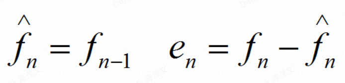
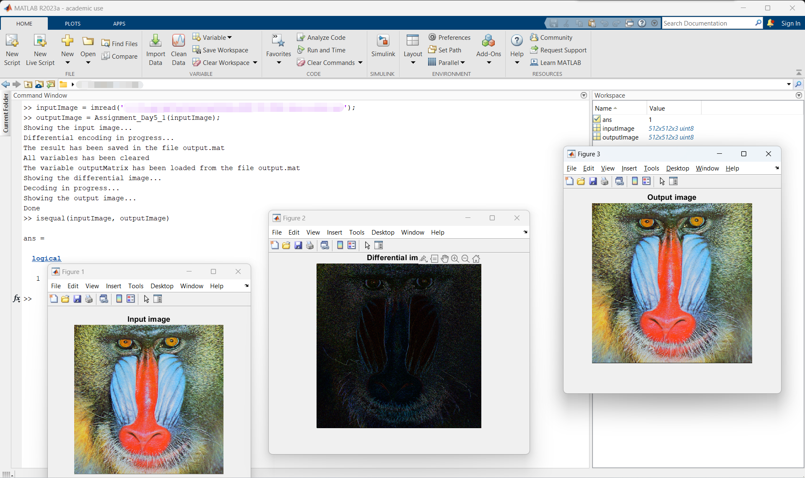

# MATLAB实验报告（四）

```
学号：
姓名：
实验时间：
实验地点：
```

本次实验作业如下：

> 编写代码实现如下功能：
> 
> 输入灰度/真彩色图像，利用差分编码思想对其进行重编码并存储为数据 文件；
> 
> 装载编码后的数据文件进行解码得到原始图像文件并显示。

上述功能在[Assignment_Day5_1.m](./code/Assignment_Day5_1.m)中实现。

## Assignment_Day5_1.m

### 源代码

```matlab
function [outputImage] = Assignment_Day5_1(inputImage)
disp('Showing the input image...');
pause(1);
figure;
imshow(inputImage);
title('Input image');
pause(2);
disp('Differential encoding in progress...');
inputImage = double(inputImage);
if size(inputImage, 3) == 1
[rows, cols] = size(inputImage);
outputMatrix = zeros(size(inputImage));
outputMatrix(1, 1) = inputImage(1, 1);
for col = 2:cols
    outputMatrix(1, col) = inputImage(1, col) - inputImage(1, col-1);
end
for row = 2:rows
    outputMatrix(row, 1) = inputImage(row, 1) - inputImage(row-1, 1);
    for col = 2:cols
        outputMatrix(row, col) = inputImage(row, col) - inputImage(row, col-1);
    end
end
else
[rows, cols, ~] = size(inputImage);
outputMatrix = zeros(size(inputImage));
for channel = 1:3
outputMatrix(1, 1, channel) = inputImage(1, 1, channel);
for col = 2:cols
    outputMatrix(1, col, channel) = inputImage(1, col, channel) - inputImage(1, col-1, channel);
end
for row = 2:rows
    outputMatrix(row, 1, channel) = inputImage(row, 1, channel) - inputImage(row-1, 1, channel);
    for col = 2:cols
        outputMatrix(row, col, channel) = inputImage(row, col, channel) - inputImage(row, col-1, channel);
    end
end
end
end
save('output.mat', "outputMatrix");
pause(2);
disp('The result has been saved in the file output.mat');
clear all;
pause(1);
disp('All variables has been cleared');
load('output.mat', 'outputMatrix');
pause(1);
disp('The variable outputMatrix has been loaded from the file output.mat');
pause(2);
disp('Showing the differential image...');
pause(1);
figure;
imshow(uint8(abs(outputMatrix)), []);
title('Differential image');
pause(1);
disp('Decoding in progress...');
if size(outputMatrix, 3) == 1
[rows, cols] = size(outputMatrix);
outputImage = zeros(size(outputMatrix));
outputImage(1, 1) = outputMatrix(1, 1);
for col = 2:cols
    outputImage(1, col) = outputMatrix(1, col) + outputImage(1, col-1);
end
for row = 2:rows
    outputImage(row, 1) = outputMatrix(row, 1) + outputImage(row-1, 1);
    for col = 2:cols
        outputImage(row, col) = outputMatrix(row, col) + outputImage(row, col-1);
    end
end
pause(2);
disp('Showing the output image...');
pause(1);
outputImage = uint8(outputImage);
figure;
imshow(outputImage);
title('Output image');
else
[rows, cols, ~] = size(outputMatrix);
outputImage = zeros(size(outputMatrix));
for channel = 1:3
    outputImage(1, 1, channel) = outputMatrix(1, 1, channel);
for col = 2:cols
    outputImage(1, col, channel) = outputMatrix(1, col, channel) + outputImage(1, col-1, channel);
end
for row = 2:rows
    outputImage(row, 1, channel) = outputMatrix(row, 1, channel) + outputImage(row-1, 1, channel);
    for col = 2:cols
        outputImage(row, col, channel) = outputMatrix(row, col, channel) + outputImage(row, col-1, channel);
    end
end
end
pause(2);
disp('Showing the output image...');
pause(1);
outputImage = uint8(outputImage);
figure;
imshow(outputImage);
title('Output image');
end
disp('Done');
end
```

### 函数说明

该函数接收一个输入，传回一个输出。 输入和输出都是矩阵，实际上都表示图像。输出图像矩阵`outputImage`是输入的图像矩阵`inputImage`经过差分编码后再重新解码后得到的矩阵。显然，我们的输出和输入应该完全一样，这是我们代码正确性的必要条件。

此外，在代码运行的过程中，将在当前工作目录下写入一个`output.mat`文件。该文件包含一个名为`outputMatrix`的变量，该变量是`inputImage`经过差分编码之后得到的矩阵。

下面我将详细阐述该函数。

首先，函数在屏幕上显示输入的图像。

然后开始差分编码过程：

输入的图像默认为`uint8`类型，元素的范围为`[0, 255]`。由于我们要进行差分编码，结果将位于`[-255, 255]`之间。为了防止编码过程中出现错误，将之转换为`double`类型，再开始编码。

编码前先检测图像类型。如果为灰度图，则直接编码；如果为真彩色图像，则在R，G，B三个通道上分别编码。两种图像的编码方式完全一样，下面以灰度图编码为例说明：

首先提取出图像的行数和列数，初始化输出矩阵。

然后对第一个（第一行第一列的）像素特殊处理，直接赋值到输出矩阵里。

然后从第一行第二列的像素开始，对其余的第一行像素进行差分编码。差分编码依照如下公式：



然后开始逐行差分编码。每行的第一个元素都需要特殊处理，但仍然遵循上述公式。

需要特别说明的是：除了第一列的元素没有前一列之外，其他所有列上的所有元素的前一个元素都是**它同一行前一列的元素**，也就是**它左边与它相邻的元素**。对于第一列的，除了第一行第一列的元素没有前一行之外，其他所有行上的所有元素的前一个元素都是**它同一列前一行的元素**，也就是**它上边与它相邻的元素**。第一行第一列的元素直接由原图像第一行第一列的元素决定，**与之相同**，也就是将原图的第一行第一列的元素**直接拿到**编码后的矩阵中，作为第一行第一列的元素。

更具体一点，请参考下图：

```
┌────────────────────────────────────────────────┐     
│                                                │     
│ X ───────────────────────────────────────────► │     
│ │                                              │     
│ │ ───────────────────────────────────────────► │     
│ │                                              │     
│ │ ───────────────────────────────────────────► │     
│ │                                              │     
│ │ ───────────────────────────────────────────► │     
│ │                                              │     
│ │ ───────────────────────────────────────────► │     
│ │                                              │     
│ │ ───────────────────────────────────────────► │     
│ │                                              │     
│ │ ───────────────────────────────────────────► │     
│ │                                              │     
│ │ ───────────────────────────────────────────► │     
│ │                                              │     
│ │ ───────────────────────────────────────────► │     
│ │                                              │     
│ │ ───────────────────────────────────────────► │     
│ │                                              │     
│ │ ───────────────────────────────────────────► │     
│ ▼                                              │     
└────────────────────────────────────────────────┘     
                                                       
                                                       
                                    ┌─────────────────┐
                                    │                 │
                                    │Front───────►Back│
                                    │                 │
                                    └─────────────────┘
```

最左上角的`X`是第一行第一列的元素。

至此为止，已经完成了差分编码。

然后将差分结果使用`save`函数存入`output.mat`文件中即可，

接下来，装载编码后的数据文件并进行解码。

在装载之前，先调用`clear all;`清除所有变量，确保我们接下来使用的`outputMatrix`变量是从`output.mat`文件中装载进来的。

调用`load`函数装载`output.mat`文件，装载之后首先显示编码结果矩阵。

我仍将以图像形式显示该矩阵。但是由于差分结果是范围在`[-255, 255]`之内的`double`型数据，我将对其取绝对值，再强制转换为`uint8`型后调用`imshow`函数显示。

然后开始解码。

解码是编码的逆过程，只要将上述编码过程反过来即可。我将以真彩色图像解码为例说明。

首先调用`size`函数取得图像的行数和列数。注意RGB图像的`size`函数返回三个数值，将第三个忽略即可。

然后初始化输出图像。

由于RGB图像有R、G、B三个通道，我们需要对每个通道分别解码。

对于每一个通道，按照编码时的顺序解码：首先第一行第一列，然后第一行，然后其他行（每行的第一列特殊处理）。解码的公式与编码的公式实际上是一样的：


如上图，编码时是求e<sub>n</sub>，解码时是求f<sub>n</sub>，移项即可。

于是即可成功解码。

由于我们初始化输出图像时调用了`zeros`函数，于是经过上述解码操作后，我们将得到`double`型数据。将之强制转换为`uint8`类型，最后调用`imshow`函数显示输出图像即可。

### 运行说明

采用MATLAB基本函数调用方法调用`Assignment_Day5_1`函数即可。

示例：

```matlab
outputImage = Assignment_Day5_1(inputImage);
```

如[前文](#函数说明)所述，调用`Assignment_Day5_1`函数后得到的输出`outputImage`将与输入`inputImage`完全相同。

我们可以调用`isequal`函数来检查：

```matlab
isequal(inputImage, outputImage)
```

显示(logical)1则说明完全相同，得到验证。

### 运行结果截图


